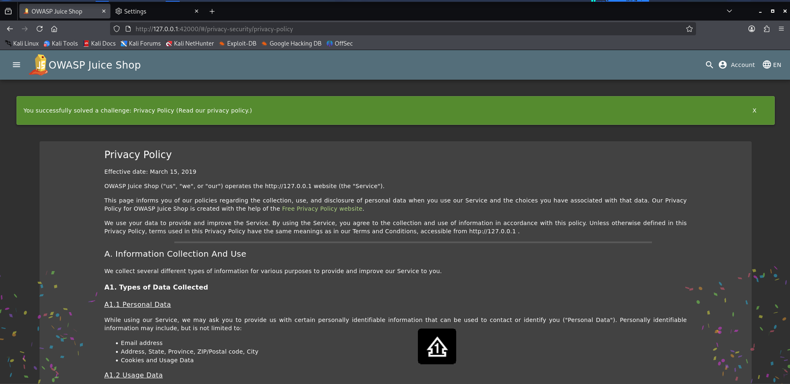

# Privacy Policy

**Category:** Miscellaneous  
**Difficulty:** ⭐  
**Assignee:** Emmanuel Oshike  
**Status:** [x] Completed  

## Objective
Read our privacy policy.

## Tools Used
* Web browser (e.g., Firefox)

## Analysis & Approach
This is an introductory reconnaissance challenge. Web applications typically host legal and compliance documents (like Privacy Policies or Terms of Service) on publicly accessible endpoints. The goal here is simply to explore the application's user interface and locate these standard pages, which in real-world scenarios might occasionally leak internal developer information, emails, or business logic.

## Steps to Reproduce
1. Open your web browser and navigate to the Juice Shop homepage.
2. Open the main navigation menu (the hamburger icon in the top left corner) or scroll to the footer links at the bottom of the page.
3. Locate and click on the **Privacy & Security** menu, then select **Privacy Policy**. Alternatively, manually navigate to `/#/privacy-security/privacy-policy` in your URL bar.
4. Once the page renders, the challenge is instantly triggered and the green success banner appears.

## Proof of Concept (PoC)

**Payload Used:**
```text
No payload required. Standard GET request to the UI route.
```
## Request/Response Snippet:
```json
GET /#/privacy-security/privacy-policy HTTP/1.1
Host: localhost:3000

HTTP/1.1 200 OK
```

## Root Cause & Remediation
**Why did this happen?**
This is not a security vulnerability. It is an onboarding task designed by the Juice Shop creators to encourage users to manually map the application's interface, test basic navigation paths, and familiarize themselves with the score tracking mechanism.

**How to fix it:**
No remediation is required. Hosting a publicly accessible Privacy Policy is a standard legal and operational requirement for web applications.
