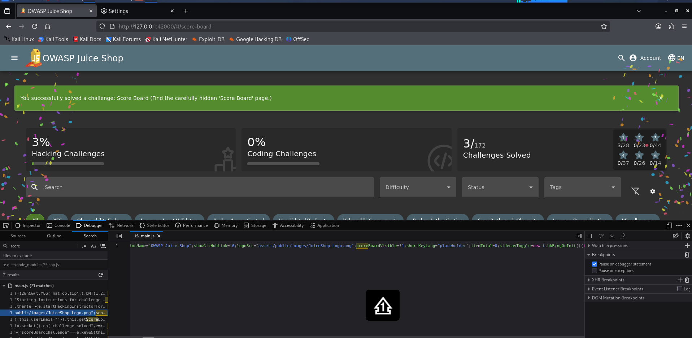

# Score Board

**Category:** Score Board  
**Difficulty:** ⭐  
**Assignee:** Emmanuel Oshike  
**Status:** [x] Completed  

## Objective
Find the hidden Score Board page in the application.

## Tools Used
* Web browser (e.g., Firefox or Chrome)
* Browser Developer Tools (F12)

## Analysis & Approach
The OWASP Juice Shop intentionally conceals the link to its Score Board from the main navigation menu to encourage basic web application reconnaissance. In Single Page Applications (SPAs) built with frameworks like Angular, all application routes are packaged and delivered to the client inside front-end JavaScript bundles. By inspecting the source code or testing common route paths, the hidden route can easily be discovered.

## Steps to Reproduce
1. Open your browser and navigate to the Juice Shop homepage (`http://localhost:3000`).
2. Open Developer Tools (press `F12` or right-click and select **Inspect**).
3. Navigate to the **Debugger** or **Sources** tab and inspect the main JavaScript bundle (e.g., `main.js`), or search the source files for route keywords such as `score-board`.
4. Identify the route `/score-board`.
5. Enter `/#/score-board` directly into the browser's address bar.
6. Press Enter. The page loads the progress dashboard, triggering the green success banner for completing the challenge.

## Proof of Concept (PoC)

**Payload Used:**
```text
No payload required. Direct URL navigation to /#/score-board.
```
## Request/Response Snippet:
``` json
GET /#/score-board HTTP/1.1
Host: localhost:3000

HTTP/1.1 200 OK
```


## Root Cause & Remediation
**Why did this happen?**
The application relied on "security through obscurity" by omitting the link to the Score Board from the visible UI, while leaving the underlying Angular route component exposed in client-side script files.

**How to fix it:**
* Do not rely on hiding client-side links or routes as a security measure.
* If a page or endpoint contains restricted functionality, protect it using proper authentication and authorization guards (e.g., Angular Route Guards combined with server-side access controls) rather than merely hiding navigation controls.
