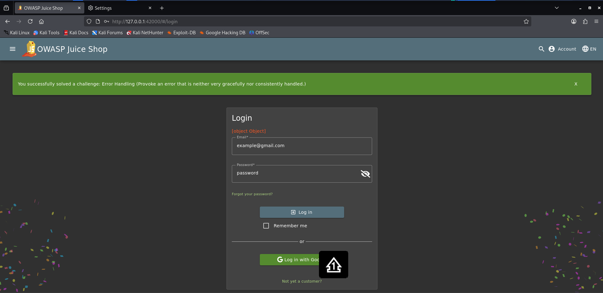

# Error Handling

**Category:** Security Misconfiguration  
**Difficulty:** ⭐  
**Assignee:** Emmanuel Oshike  
**Status:** [x] Completed  

## Objective
Provoke an error that is neither very gracefully nor consistently handled.

## Tools Used
* Web browser
* Burp Suite Community Edition

## Analysis & Approach
Web applications should always fail securely and gracefully. When an error occurs, the server should return a generic error message to the user rather than exposing technical details, stack traces, or framework versions. To solve this, I need to send unexpected or malformed data to an API endpoint to force the application to crash or throw an unhandled exception, causing it to leak a stack trace to the frontend.

## Steps to Reproduce
1. Navigate to the Juice Shop login page (`/#/login`).
2. Turn on intercept in Burp Suite.
3. Enter a random email and password, then click "Log in".
4. In Burp Suite, locate the intercepted POST request to `/rest/user/login`.
5. Intentionally corrupt the JSON payload in the request body. For example, delete the closing quotation mark on the email address so the JSON becomes invalid syntax.
6. Forward the corrupted request to the server.
7. Observe the HTTP response. The server fails to parse the JSON and returns an ugly `500 Internal Server Error` containing the full Express.js/body-parser stack trace.
8. The green success banner for the "Error Handling" challenge drops down on the UI.

## Proof of Concept (PoC)

**Payload Used:**
```json
{
  "email": "example@gmail.com,
  "password": "password"
}
(Notice the missing closing quotation mark after .com)
```

## Request/Response Snippet:
``` json
POST /rest/user/login HTTP/1.1
Host: localhost:3000
Content-Type: application/json

{"email": "example@gmail.com, "password": "password"}

HTTP/1.1 500 Internal Server Error
Content-Type: text/html; charset=utf-8

SyntaxError: Unexpected token p in JSON at position 28
    at JSON.parse (<anonymous>)
    at parse (/app/node_modules/body-parser/lib/types/json.js:89:19)
    ...
```


## Root Cause & Remediation
**Why did this happen?**
The backend Express application does not have a global error handler configured to catch syntax errors from the body-parser middleware. When the malformed JSON causes a crash, the default behavior of the framework is to return the raw stack trace to the client, exposing internal implementation details.

**How to fix it:**
* Implement a global error-handling middleware function in Node.js/Express.
* Ensure all endpoints return standardized, sanitized HTTP responses (e.g., returning a simple 400 Bad Request with "Invalid JSON format" instead of a stack trace).
